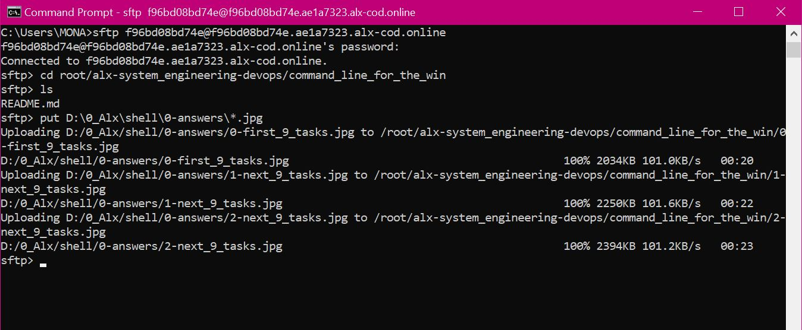

# Command line for the win

[CMD CHALLENGE](https://cmdchallenge.com/) is a pretty cool game challenging you on Bash skills. Everything is done via the command line and the questions are becoming increasingly complicated. It’s a good training to improve your command line skills!

Here are the steps to use the SFTP (Secure File Transfer Protocol) command-line tool to move your local screenshots to the sandbox environment:

1: Open a terminal or command prompt on your local machine.

2: Use the SFTP command-line tool to establish a connection to the sandbox environment. You will need the hostname, username, and password provided to you for the sandbox environment.

`sftp username@hostname` then enter the password when prompted to authenticate `password`

3: Once connected, navigate to the directory where you want to upload the screenshots.

`cd root/alx-system_engineering-devops/command_line_for_the_win`

4: Use the SFTP put command to upload the screenshots from your local machine to the sandbox environment.

`put path_to_local_screenshots\*.jpg`

5: Confirm that the screenshots have been successfully transferred by checking the sandbox directory.

`ls`

